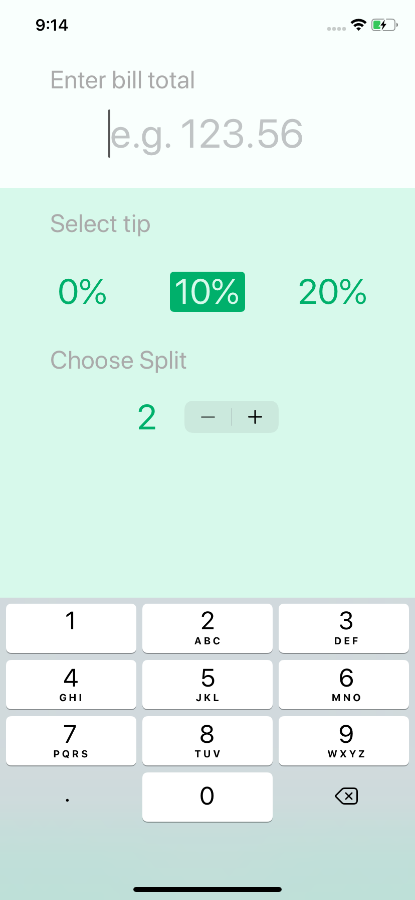
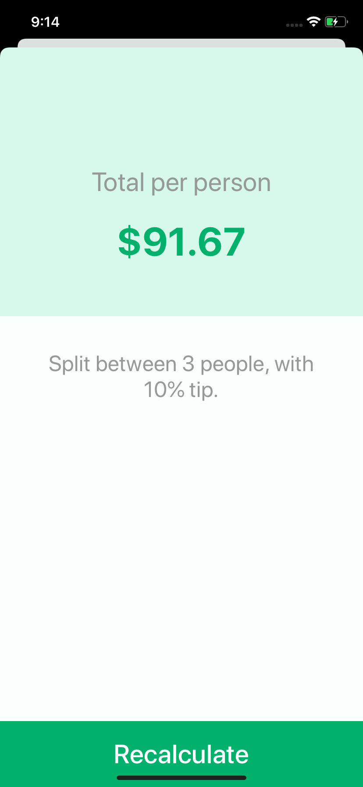

#  Tipsy - Split the Bills!

A simple app for users to split their bills. The app also offers options to select a percentage for tips. Supports both iPhone and iPad.

## Screenshots

     

## What I have learned

* How to add constraints and how auto layout works.
* Pin and align UI elements.
* Create containers to configure advanced layouts.
* Stack views.
* Mutating functions.

## Credits

>This is a companion project to The App Brewery's Complete App Development Bootcamp, full course at [www.appbrewery.co](https://www.appbrewery.co/)
